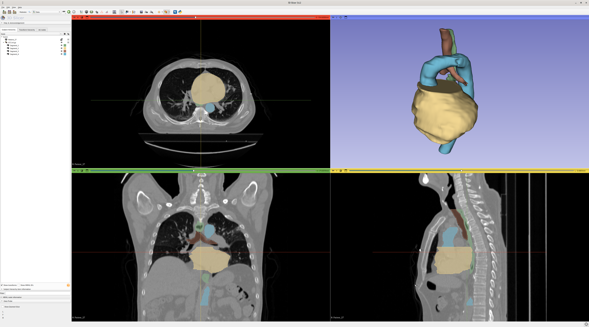

# AI for medical imaging — Fall 2024 course project

Alessandro, Erik, Joost, Rory & Taiki

## Running on Snellius
After creating the environment you need to run the following lines to run the main.py

```
$ source ai4mi/bin/activate
$ module load 2022
$ module load Python/3.10.4-GCCcore-11.3.0

# Ask for the GPU node can be done by running the line below or make a job file and run with sbatch command.
$ srun --partition=gpu --gpus=1 --ntasks=1 --cpus-per-task=18 --time=00:59:00 --pty bash -i

# You can run the following command to train and get result of a model.
$ python -O main.py --dataset SEGTHOR --mode full --epoch 25 --dest results/segthor/ce --gpu
```


## Project overview
The project is based around the SegTHOR challenge data, which was kindly allowed by Caroline Petitjean (challenge organizer) to use for the course. The challenge was originally on the segmentation of different organs: heart, aorta, esophagus and trachea.


### Getting the data
Generation the data, via the recipe in the `Makefile`:
```
$ make data/TOY2
$ make data/SEGTHOR
```

The synthetic dataset is generated randomly, whereas for Segthor it is required to put the file [`segthor_train.zip`](https://amsuni-my.sharepoint.com/:u:/g/personal/h_t_g_kervadec_uva_nl/EfMdFte7pExAnPwt4tYUcxcBbJJO8dqxJP9r-5pm9M_ARw?e=ZNdjee) (required a UvA account) in the `data/` folder. If the computer running it is powerful enough, the recipe for `data/SEGTHOR` can be modified in the [Makefile](Makefile) to enable multi-processing (`-p -1` option, see `python slice_segthor.py --help` or its code directly).

## Submission and scoring
Groups will have to submit:
* archive of the git repo with the whole project (pre-processing/training/post-processing where applicable, inference and metrics);
* the best trained model;
* predictions on the test set (will be shared later on);
* predictions on the group's internal validation set, validation set, and the metrics they computed.

The main criteria for scoring will include:
* improvement of performances over baseline;
* code quality/clear [git use](git.md);
* the [choice of metrics](https://metrics-reloaded.dkfz.de/);
* correctness of the computed metrics (on the validation set);
* (part of the report) clear description of the method;
* report.


### Packing the code
`$ git bundle group-XX.bundle master`

### Saving the best model
`torch.save(net, args.dest / "bestmodel-group-XX.pkl")`

### Archiving everything for submission
All files should be grouped in single folder with the following structure
```
group-XX/
    test/
        pred/
            Patient_41.nii.gz
            Patient_42.nii.gz
            ...
    val/
        pred/
            Patient_21.nii.gz
            Patient_32.nii.gz
            ...
        gt/
            Patient_21.nii.gz
            Patient_32.nii.gz
            ...
        metric01.npy
        metric02.npy
        ...
    group-XX.bundle
    bestmodel-group-XX.pkl
```
The metrics should be numpy `ndarray` with the shape `NxKxD`, with `N` the number of scan in the subset, `K` the number of classes (5, including background), and `D` the eventual dimensionality of the metric (can be simply 1).

The folder should then be [tarred](https://xkcd.com/1168/) and compressed, e.g.:
```
$ tar cf - group-XX/ | zstd -T0 -3 > group-XX.tar.zst
$ tar cf group-XX.tar.gz - group-XX/
```
